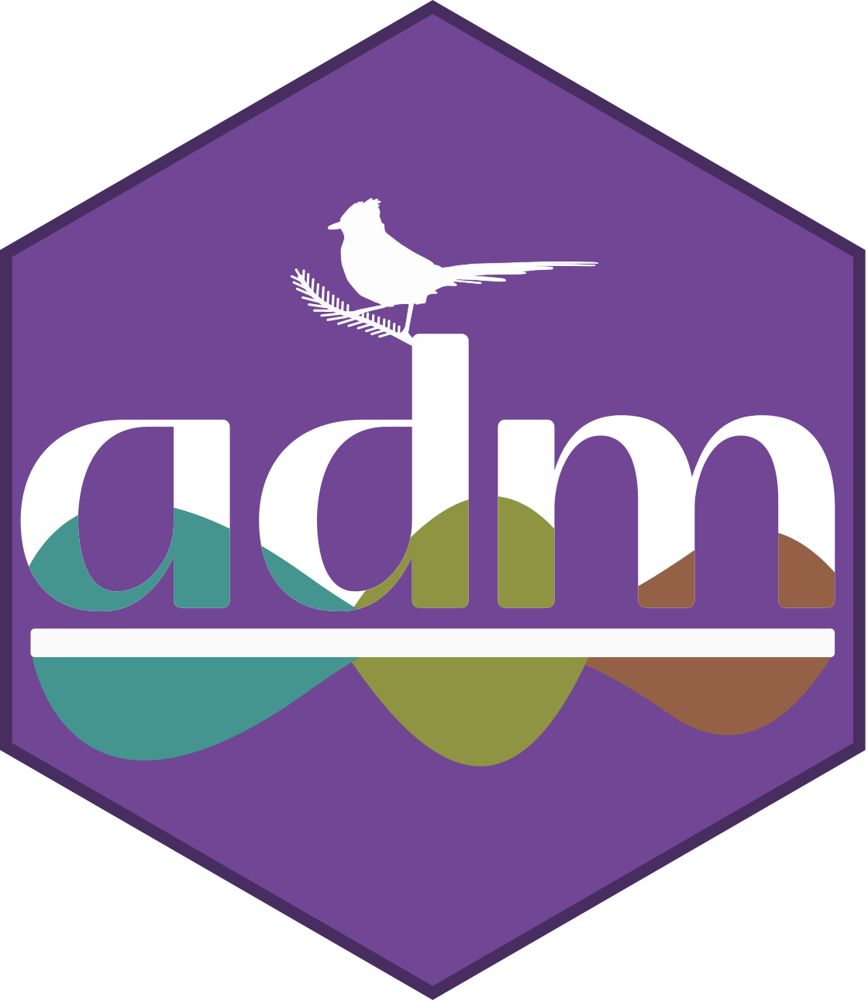

Software and research projects where I am an active contributor or lead developer.

 

:::::: columns
::: {.column width="60%"}
### [`gen3sis`](https://github.com/user/gen3sis)

A general engine for eco-evolutionary simulations. It allows researchers to explore the mechanisms shaping biodiversity patterns across space and time by integrating geological, climatic, and biological processes.

- **Status:** CRAN | Active development
- **Role:** Core developer
:::

::: {.column width="5%"}
:::

::: {.column width="35%"}
{width="600px"}
:::
::::::

---

:::::: columns
::: {.column width="60%"}
### [`adm`](https://github.com/sjevelazco/adm)

An R package for constructing Abundance-based Species Distribution Models. Developed as part of my Master's thesis, `adm` provides a complete workflow for tuning, fitting and validating models with nine machine learning algorithms.

- **Status:** CRAN-ready | Active development
- **Role:** Main developer and maintainer
:::

::: {.column width="5%"}
:::

::: {.column width="35%"}
{width="200px"}
:::
::::::

---

:::::: columns
::: {.column width="60%"}
### [`flexsdm`](https://github.com/sjevelazco/flexsdm)

A comprehensive R package for Species Distribution Modeling. It provides tools for data cleaning, pseudo-absence sampling, model fitting, and ensemble modeling within a flexible and modern framework based on machine learning and other statistical methods.

- **Status:** CRAN | Active development
- **Role:** Contributor
:::

::: {.column width="5%"}
:::

::: {.column width="35%"}
{width="200px"}
:::
::::::